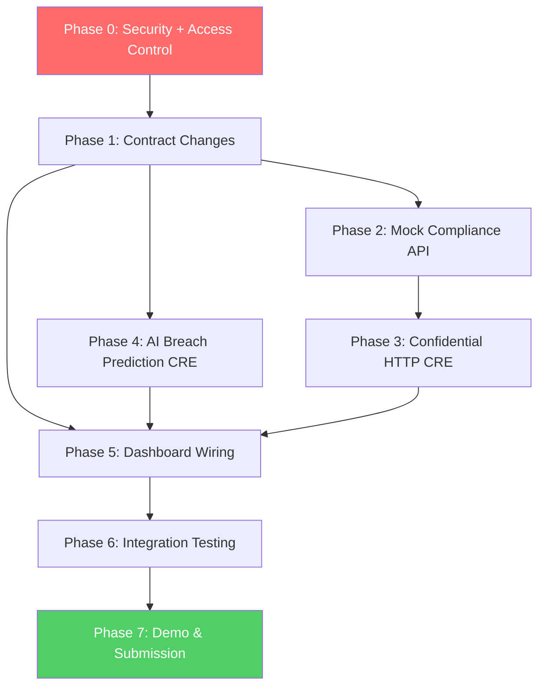

# OathLayer Convergence Hackathon Enhancements

## Enhancement Summary

**Deepened on:** 2026-03-01
**Agents used:** Security Sentinel, Architecture Strategist, Performance Oracle, Code Simplicity Reviewer, Best Practices Researcher, Framework Docs Researcher

### Key Improvements from Deepening
1. **Day 1 blocker resolved:** CRE SDK *does* export `ConfidentialHTTPClient` in TypeScript — no fallback needed
2. **Gemini consensus strategy decided:** Use `consensusMedianAggregation` on numeric `riskScore` only — not `identical` on full text (which will fail due to LLM non-determinism)
3. **Security fixes surfaced:** Private key in repo root, Gemini API key in URL query string, `penaltyBps` caller-supplied instead of read from storage
4. **Dashboard data model corrected:** Use `getLogs` (viem) for historical events + `useWatchContractEvent` for real-time; use `useReadContracts` multicall for batch SLA reads
5. **PENDING state redesigned:** Drop as a meaningful UI concept — set compliance directly to APPROVED/REJECTED in the same CRE handler that does the relay
6. **Simplifications applied:** Inline wrapper functions, replace `POST /set-compliance` with ENV flag, drop `recommendedAction` from Gemini prompt, add `breachCount` state var instead of event-counting

### Critical Pre-Implementation Actions
1. Add `signing-key-*.json` to `.gitignore` immediately — private key exposed in repo root
2. Fix `recordBreach()` access control before any other contract work
3. Change `recordBreach()` to read `penaltyBps` from SLA storage, not from caller parameter

---

## Overview

Enhance OathLayer from a functional SLA enforcement prototype into a **privacy-first, AI-powered compliance platform for tokenized real-world assets**. Two net-new features layered onto a 70%-complete codebase, targeting 5 prize pools ($31-32K max).

**Enhancement 1:** Confidential HTTP Compliance Layer — encrypted KYC/compliance checks via CRE `ConfidentialHTTPClient` before providers can bond collateral.

**Enhancement 2:** AI Breach Prediction — Gemini Flash analyzes uptime trends to predict breaches before they happen, using `consensusMedianAggregation` on the numeric risk score.

**Critical prerequisite:** Fix `recordBreach()` access control (currently callable by anyone) and secure exposed private key.

## Problem Statement / Motivation

OathLayer currently:
- Has no compliance gate — any World ID-verified address can bond collateral and create SLAs
- Uses reactive breach detection only — detects breaches after they happen, never predicts them
- Has an open access control bug on `recordBreach()` — anyone can slash bonds
- Has an exposed private key in repo root (`signing-key-0x13C84e.json`)
- Dashboard shows mock data, not live chain state
- `penaltyBps` in `recordBreach()` is caller-supplied instead of read from SLA storage

These gaps prevent credible judging on Risk & Compliance and Privacy tracks. The enhancements address all of them.

## Proposed Solution

### Architecture

```
┌─────────────────────────────────────────────────────────────────────┐
│                        OathLayer System                            │
│                                                                     │
│  World Chain (4801)           CRE Workflows              Sepolia   │
│  ┌──────────────────┐   ┌─────────────────────┐   ┌──────────────┐ │
│  │ WorldChainRegistry│   │ 1. Cron (15min)     │   │SLAEnforcement│ │
│  │                  │   │    → fetch metrics   │   │              │ │
│  │ register() ──────┼──→│      (consensus)     │   │ recordBreach │ │
│  │  ProviderReg     │   │    → Gemini Flash    │   │   (CRE-only) │ │
│  │  Requested       │   │      (median agg)    │──→│ recordWarn   │ │
│  │                  │   │    → breach predict  │   │   (CRE-only) │ │
│  │                  │   │                     │   │              │ │
│  │                  │   │ 2. ProviderRegReq   │   │ compliance   │ │
│  │                  │   │    → ConfidHTTP     │──→│ Gate         │ │
│  │                  │   │    → compliance API  │   │              │ │
│  │                  │   │    → relay or reject │   │ createSLA    │ │
│  └──────────────────┘   │                     │   │ (gated)      │ │
│                         │ 3. ClaimFiled react │   │              │ │
│                         │ 4. ArbitratorReg    │   │ breachCount  │ │
│                         └─────────────────────┘   └──────────────┘ │
│                                                                     │
│  Dashboard (Next.js)          Mock APIs (:3001)                    │
│  ┌──────────────────┐   ┌─────────────────────┐                    │
│  │ / — live SLAs    │   │ /provider/:addr/    │                    │
│  │   (multicall),   │   │   uptime            │                    │
│  │   breach alerts  │   │ /compliance/:addr   │                    │
│  │   (getLogs),     │   │   → mock KYC check  │                    │
│  │   risk scores    │   │   (ENV flag for     │                    │
│  │ /provider/reg    │   │    rejection demo)  │                    │
│  └──────────────────┘   └─────────────────────┘                    │
└─────────────────────────────────────────────────────────────────────┘
```

### Key Design Decisions

| Decision | Choice | Rationale |
|---|---|---|
| ComplianceStatus type | `enum(NONE, APPROVED, REJECTED)` | PENDING dropped — CRE sets status in same handler as relay, so PENDING is never observable. Dashboard shows UI-level spinner for X seconds after World Chain tx confirms, then polls. |
| Breach warning dedup | 4-hour cooldown per SLA | Required for correctness: 15-min cron would spam identical warnings. Also prevents gas waste. Demo note: ensure cooldown has expired before demo segment. |
| Risk threshold | `riskScore > 70` (strictly greater) | Leaves headroom; 70 = "elevated but not actionable" |
| Re-registration after rejection | Not allowed — add `require(providerCompliance[provider] != ComplianceStatus.REJECTED)` guard in `setComplianceStatus` | Prevents CRE misconfiguration from re-approving rejected providers |
| CRE-only enforcement | `onlyCREForwarder` modifier with `immutable creForwarder` + `onlyOwner` setter for post-deploy flexibility | Mark `creForwarder` immutable if address is known at deploy; add setter with `onlyOwner` if not |
| Compliance API | Mock at `:3001` with ENV flag `DEMO_REJECT_ADDRESS` for rejection demo | No `POST /set-compliance` endpoint — reduces demo failure surface |
| Gemini consensus | `consensusMedianAggregation` on `riskScore` only — NOT `identical` on full response | LLM outputs are non-deterministic even at temperature=0. Median aggregation tolerates variance across DON nodes. |
| Gemini API key | Via `x-goog-api-key` header, NOT URL query string | Keys in URLs appear in logs, proxies, and browser history |
| Gemini prompt | Request `{ riskScore, prediction }` only — drop `recommendedAction` | Parsed but never used; eliminates dead field |
| `penaltyBps` in `recordBreach` | Read from `slas[slaId].penaltyBps` storage, remove caller parameter | Eliminates attack surface where CRE misconfiguration could set wrong penalty |
| Dashboard breach count | `uint256 public breachCount` state var incremented in `recordBreach()` | Avoids fragile `useContractEvents` event-counting with block range limits |
| Dashboard SLA reads | `useReadContracts` multicall batch | Avoids hooks-in-loop violation and reduces N+1 RPC calls to 2 |
| Dashboard historical events | `getLogs` (viem public client) on mount + poll every 30s | `useWatchContractEvent` only catches new events, not historical |

---

## Implementation Plan

### Phase 0: Security Fixes & Access Control (Day 1 — BLOCKER)

**Immediate — before any other work:**

- [x] Add `signing-key-*.json` to `.gitignore`
- [x] Run `git rm --cached signing-key-0x13C84e.json` if staged
- [ ] Rotate the exposed key — treat `0x13C84e` as compromised
- [x] Add `*.env*` patterns to `.gitignore` if not already present

**File: `contracts/src/SLAEnforcement.sol`**

- [x] Add `onlyCREForwarder` modifier: `require(msg.sender == creForwarder, "Only CRE forwarder")`
- [x] Apply to `recordBreach()` — currently has NO access control
- [x] Verify `registerProviderRelayed()` and `registerArbitratorRelayed()` already check (they do)
- [x] Change `recordBreach()` signature: remove `penaltyBps` parameter, read from `slas[slaId].penaltyBps` instead
- [x] Add `require(_creForwarder != address(0))` in constructor
- [ ] Redeploy to Tenderly VNet
- [x] Add test: `recordBreach` from non-CRE address reverts

```solidity
// contracts/src/SLAEnforcement.sol — Phase 0 changes

modifier onlyCREForwarder() {
    require(msg.sender == creForwarder, "Only CRE forwarder");
    _;
}

// CHANGED: removed penaltyBps parameter, reads from SLA storage
function recordBreach(uint256 slaId, uint256 uptimeBps) external onlyCREForwarder {
    SLA storage sla = slas[slaId];
    require(sla.active, "SLA not active");
    uint256 penaltyAmount = (sla.bondAmount * sla.penaltyBps) / 10000;
    // ... rest of existing logic
}
```

### Research Insights — Access Control

**Best Practices (from Chainlink Forwarder pattern):**
- The CRE `ReceiverTemplate` pattern uses exactly this: constructor takes forwarder address, stores it, checks `msg.sender == forwarder`
- Use custom error `error OnlyCREForwarder()` instead of string revert for gas savings (not critical on VNet)

**Foundry test pattern:**
```solidity
function test_RevertWhen_NonCRECallsRecordBreach() public {
    address attacker = address(0xBAD);
    vm.expectRevert("Only CRE forwarder");
    vm.prank(attacker);
    slaContract.recordBreach(slaId, 9800);
}

function test_RecordBreach_FromCRE_Succeeds() public {
    vm.prank(creForwarder);
    vm.expectEmit();
    emit SLABreached(slaId, provider, 9800, expectedPenalty);
    slaContract.recordBreach(slaId, 9800);
}
```

---

### Phase 1: Contract Changes (Day 1-2)

**File: `contracts/src/SLAEnforcement.sol`**

Enhancement 1 — Compliance:
- [x] Add `ComplianceStatus` enum: `NONE, APPROVED, REJECTED` (PENDING dropped — see rationale above)
- [x] Add `mapping(address => ComplianceStatus) public providerCompliance`
- [x] Add `complianceGate` modifier on `createSLA`: `require(providerCompliance[msg.sender] == ComplianceStatus.APPROVED, "Not compliant")`
- [x] Add `setComplianceStatus(address provider, ComplianceStatus status)` — CRE-only, with rejection permanence guard
- [x] Add events: `ComplianceCheckPassed(address indexed provider)`, `ComplianceCheckFailed(address indexed provider, string reason)`

Enhancement 2 — Breach Prediction:
- [x] Add `BreachWarning(uint256 indexed slaId, uint256 riskScore, string prediction)` event
- [x] Add `recordBreachWarning(uint256 slaId, uint256 riskScore, string calldata prediction)` — CRE-only
- [x] Add `mapping(uint256 => uint256) public lastWarningTime` — cooldown tracking
- [x] Add `uint256 public breachCount` — incremented in `recordBreach()` for dashboard stat card
- [x] Enforce 4-hour cooldown: `require(block.timestamp - lastWarningTime[slaId] >= 4 hours)`

```solidity
// contracts/src/SLAEnforcement.sol — Phase 1 additions

enum ComplianceStatus { NONE, APPROVED, REJECTED }

mapping(address => ComplianceStatus) public providerCompliance;
mapping(uint256 => uint256) public lastWarningTime;
uint256 public breachCount;

modifier complianceGate() {
    require(providerCompliance[msg.sender] == ComplianceStatus.APPROVED, "Not compliant");
    _;
}

event ComplianceCheckPassed(address indexed provider);
event ComplianceCheckFailed(address indexed provider, string reason);
event BreachWarning(uint256 indexed slaId, uint256 riskScore, string prediction);

function setComplianceStatus(address provider, ComplianceStatus status) external onlyCREForwarder {
    // Permanent rejection — prevents CRE misconfiguration from re-approving
    require(providerCompliance[provider] != ComplianceStatus.REJECTED, "Permanently blocked");
    providerCompliance[provider] = status;
    if (status == ComplianceStatus.APPROVED) {
        emit ComplianceCheckPassed(provider);
    } else if (status == ComplianceStatus.REJECTED) {
        emit ComplianceCheckFailed(provider, "Compliance check failed");
    }
}

function recordBreachWarning(uint256 slaId, uint256 riskScore, string calldata prediction) external onlyCREForwarder {
    require(block.timestamp - lastWarningTime[slaId] >= 4 hours, "Warning cooldown");
    lastWarningTime[slaId] = block.timestamp;
    emit BreachWarning(slaId, riskScore, prediction);
}

// In recordBreach(), add:
// breachCount++;
```

### Research Insights — Contract Design

**Architecture review findings:**
- `complianceGate` stacks correctly with existing `verifiedProviders` check on `createSLA` — defense-in-depth
- Providers registered before compliance upgrade will have `ComplianceStatus.NONE` and be locked out — irrelevant for fresh VNet deploy, but document for judges
- `string prediction` in event is acceptable for hackathon (demos well); truncate to 100 chars in workflow before posting to limit gas

**Security review findings:**
- `setComplianceStatus` now guards against `REJECTED → APPROVED` transitions
- Both `ComplianceCheckPassed` and `ComplianceCheckFailed` are now emitted (original plan was missing the REJECTED emit)
- `arbitrate()` still has no on-chain effect — don't mention to judges unless asked, frame as "planned V2"

**Test patterns:**
```solidity
function test_ComplianceGate_BlocksNonCompliant() public {
    vm.prank(provider);
    vm.expectRevert("Not compliant");
    slaContract.createSLA(tenant, 24, 9900, 500);
}

function test_SetCompliance_PermanentRejection() public {
    vm.prank(creForwarder);
    slaContract.setComplianceStatus(provider, ComplianceStatus.REJECTED);

    vm.prank(creForwarder);
    vm.expectRevert("Permanently blocked");
    slaContract.setComplianceStatus(provider, ComplianceStatus.APPROVED);
}

function test_BreachWarning_Cooldown() public {
    vm.prank(creForwarder);
    slaContract.recordBreachWarning(slaId, 85, "Uptime declining");

    vm.prank(creForwarder);
    vm.expectRevert("Warning cooldown");
    slaContract.recordBreachWarning(slaId, 90, "Still declining");

    // Warp past cooldown
    vm.warp(block.timestamp + 4 hours + 1);
    vm.prank(creForwarder);
    slaContract.recordBreachWarning(slaId, 90, "Still declining"); // succeeds
}
```

---

### Phase 2: Mock Compliance API (Day 2)

**File: `workflow/mock-api/server.ts`**

- [x] Add `GET /compliance/:address` endpoint:
  ```json
  { "compliant": true, "riskLevel": "low", "reason": "KYC verified", "checks": ["identity", "sanctions", "pep"] }
  ```
- [x] Use ENV flag `DEMO_REJECT_ADDRESS` instead of `POST /set-compliance`:
  ```typescript
  // If address matches DEMO_REJECT_ADDRESS env var, return non-compliant
  const rejectAddr = process.env.DEMO_REJECT_ADDRESS?.toLowerCase();
  if (rejectAddr && req.params.address.toLowerCase() === rejectAddr) {
    return res.json({ compliant: false, riskLevel: "high", reason: "Sanctions match" });
  }
  return res.json({ compliant: true, riskLevel: "low", reason: "KYC verified" });
  ```
- [x] Default: all addresses compliant (happy path for demo)
- [x] Add auth middleware to ALL control endpoints (`/set-uptime`, `/set-provider-uptime`, `/reset`):
  ```typescript
  const requireAdminAuth = (req, res, next) => {
    if (req.headers['x-admin-token'] !== (process.env.MOCK_API_ADMIN_SECRET || 'demo-secret')) {
      return res.status(401).json({ error: 'Unauthorized' });
    }
    next();
  };
  ```

### Research Insights — Mock API

**Security review:** Control endpoints are currently unauthenticated. If mock API is exposed on a public IP for CRE to reach, anyone can manipulate uptime data and trigger/suppress breaches. The auth middleware above is a minimal fix.

---

### Phase 3: CRE Workflow — Confidential HTTP Compliance (Day 2-3)

**File: `workflow/workflow.ts`**

**BLOCKER RESOLVED:** CRE SDK exports `ConfidentialHTTPClient` in TypeScript. Use it directly:

```typescript
import { cre } from "@chainlink/cre-sdk";

// Confidential HTTP — encrypted via TEE enclaves
const confidentialClient = new cre.capabilities.ConfidentialHTTPClient();
```

Implementation (inline in `onProviderRegistrationRequested` — no wrapper function):
- [x] Modify `onProviderRegistrationRequested` handler:
  1. Decode provider address from event
  2. Fetch compliance API key: `runtime.getSecret({ id: "COMPLIANCE_API_KEY" }).result()`
  3. Call compliance API via `ConfidentialHTTPClient` — request and response encrypted in transit, DON nodes cannot see plaintext
  4. Wrap in `runInNodeMode` with `consensusIdenticalAggregation` (mock API returns deterministic results)
  5. If `compliant === true` → call `setComplianceStatus(provider, APPROVED)` + `registerProviderRelayed` on Sepolia
  6. If `compliant === false` → call `setComplianceStatus(provider, REJECTED)` on Sepolia, do NOT relay registration
- [x] Add `COMPLIANCE_API_URL` to workflow config schema
- [ ] Add `COMPLIANCE_API_KEY` as CRE secret via `cre secrets create`
- [x] Fail loudly if secret is missing: `if (!apiKey) throw new Error("COMPLIANCE_API_KEY not configured")`

```typescript
// workflow/workflow.ts — inside onProviderRegistrationRequested handler
// Inlined — no wrapper function needed (single call site)

const confidentialClient = new cre.capabilities.ConfidentialHTTPClient();
const complianceApiKey = runtime.getSecret({ id: "COMPLIANCE_API_KEY" }).result().value;
if (!complianceApiKey) throw new Error("COMPLIANCE_API_KEY secret not configured");

const complianceResult = confidentialClient.sendRequest(nodeRuntime, {
  url: `${runtime.getConfig("complianceApiUrl")}/compliance/${providerAddress}`,
  method: "GET",
  headers: {
    "Authorization": `Bearer ${complianceApiKey}`,
    "Content-Type": "application/json",
  },
}).result();

const compliance = JSON.parse(new TextDecoder().decode(complianceResult.body));

if (compliance.compliant) {
  // Set APPROVED + relay registration in same handler
  sepoliaClient.writeReport(runtime, {
    calldata: encodeFunctionData({ functionName: "setComplianceStatus", args: [providerAddress, 1] }), // 1 = APPROVED
    contractAddress: config.slaContractAddress,
  });
  // Then relay registration as before...
} else {
  // Set REJECTED, do NOT relay
  sepoliaClient.writeReport(runtime, {
    calldata: encodeFunctionData({ functionName: "setComplianceStatus", args: [providerAddress, 2] }), // 2 = REJECTED
    contractAddress: config.slaContractAddress,
  });
  runtime.log(`[OathLayer] Provider ${providerAddress} failed compliance: ${compliance.reason}`);
}
```

### Research Insights — Confidential HTTP

**From CRE SDK research:**
- `ConfidentialHTTPClient` uses TEE enclaves — CPU decrypts data only during processing; OS, hypervisor, and hardware owner cannot access data inside the enclave
- This is the correct choice for the compliance API where provider PII/credentials must stay private
- The confidentiality guarantee comes from the execution environment, not a separate encryption layer
- API surface is identical to standard `HTTPClient` — same `.sendRequest()` pattern

**From security review:**
- Remove nullifier hashes from `runtime.log()` calls — contradicts "Privacy-first" framing
- Log only: `[OathLayer] Provider ${providerAddress.slice(0,10)}... compliance: ${status}`

---

### Phase 4: CRE Workflow — AI Breach Prediction (Day 3-4)

**File: `workflow/workflow.ts`**

**Consensus strategy decided:** Use `consensusMedianAggregation` on the numeric `riskScore` only. Do NOT attempt `identical` consensus on Gemini text output — it will fail due to LLM non-determinism even at temperature=0 (confirmed bug in Gemini 2.5, affects 2.0 Flash too).

Implementation (inline in `scanSLAs()` — no wrapper function):
- [ ] After fetching uptime metrics (existing consensus block), batch all SLA data into a single Gemini prompt
- [ ] Call Gemini Flash via `ConfidentialHTTPClient` (protects API key from DON nodes)
- [ ] Use `x-goog-api-key` header — NOT URL query string
- [ ] Use `responseSchema` with strict JSON schema for deterministic structure
- [ ] Use `temperature: 0` and `responseMimeType: "application/json"`
- [ ] Extract numeric `riskScore` and aggregate via `consensusMedianAggregation`
- [ ] If `riskScore > 70` → call `recordBreachWarning(slaId, riskScore, prediction)` on Sepolia
- [ ] If actual breach detected → call `recordBreach()` as before
- [ ] Fail silently on Gemini errors (no warning emitted)
- [ ] Fail loudly on missing secret: `if (!geminiKey) throw new Error("GEMINI_API_KEY not configured")`

```typescript
// workflow/workflow.ts — inside scanSLAs(), after uptime fetch consensus block
// Inlined — single call site

const geminiKey = runtime.getSecret({ id: "GEMINI_API_KEY" }).result().value;
if (!geminiKey) throw new Error("GEMINI_API_KEY secret not configured");

// Batch ALL SLA uptime data into single Gemini prompt (1 API call, not N)
const allSlaMetrics = activeSLAs.map(sla => ({
  slaId: sla.id,
  provider: sla.provider,
  uptimeBps: sla.currentUptimeBps,
  minUptimeBps: sla.minUptimeBps,
}));

const prompt = `You are an SLA compliance analyzer. Given the following uptime metrics for infrastructure providers, predict the probability of an SLA breach in the next 24 hours for each SLA.

Metrics: ${JSON.stringify(allSlaMetrics)}

Respond with a JSON array: [{"slaId": <number>, "riskScore": <0-100>, "prediction": "<one sentence max 100 chars>"}]`;

try {
  const confidentialClient = new cre.capabilities.ConfidentialHTTPClient();
  const geminiResponse = confidentialClient.sendRequest(nodeRuntime, {
    url: "https://generativelanguage.googleapis.com/v1beta/models/gemini-2.0-flash:generateContent",
    method: "POST",
    headers: {
      "Content-Type": "application/json",
      "x-goog-api-key": geminiKey,  // Header, NOT query string
    },
    body: Buffer.from(JSON.stringify({
      contents: [{ role: "user", parts: [{ text: prompt }] }],
      generationConfig: {
        temperature: 0,
        maxOutputTokens: 512,
        responseMimeType: "application/json",
        responseSchema: {
          type: "ARRAY",
          items: {
            type: "OBJECT",
            properties: {
              slaId: { type: "INTEGER" },
              riskScore: { type: "INTEGER" },
              prediction: { type: "STRING" },
            },
            required: ["slaId", "riskScore", "prediction"],
          },
        },
      },
    })),
  }).result();

  const apiResponse = JSON.parse(new TextDecoder().decode(geminiResponse.body));
  const predictions = JSON.parse(apiResponse.candidates[0].content.parts[0].text);

  for (const pred of predictions) {
    if (pred.riskScore > 70) {
      // Truncate prediction to 100 chars to limit calldata gas
      const truncated = pred.prediction.slice(0, 100);
      sepoliaClient.writeReport(runtime, {
        calldata: encodeFunctionData({
          functionName: "recordBreachWarning",
          args: [pred.slaId, pred.riskScore, truncated],
        }),
        contractAddress: config.slaContractAddress,
      });
    }
  }
} catch (e) {
  // Fail silently — better to miss a warning than emit a false one
  runtime.log(`[OathLayer] Gemini prediction failed: ${e.message}`);
}
```

### Research Insights — Gemini Integration

**From framework docs research:**
- `responseSchema` with `responseMimeType: "application/json"` forces Gemini to output valid JSON matching the schema — use this instead of prompt-based JSON instructions
- `temperature: 0` gives greedy/deterministic decoding — best for structured extraction
- Gemini 2.5 has confirmed bugs with JSON mode + function calling — stick with 2.0 Flash
- Free tier: 15 RPM, 1M tokens/day — batching all SLAs into one prompt avoids rate limits entirely (1 call per cron tick regardless of N SLAs)

**From performance review:**
- Batching is critical: N individual Gemini calls would hit 15 RPM at N=14 (burst at cron start). Single batched prompt eliminates this entirely.
- At demo scale (2-5 SLAs), one prompt + one response ≈ 300-500 tokens total

**From best practices research:**
- `consensusMedianAggregation<number>()` tolerates ±5 point variance in `riskScore` across DON nodes
- For the `prediction` string, use `ignore` aggregation (discard) or `commonPrefix` — the string is for display only, not enforcement

**Consensus approach for the full response:**
```typescript
// Aggregate only the riskScore per SLA via median; ignore prediction text
const geminiResult = httpClient.sendRequest(
  runtime,
  fetchGeminiPredictions,
  ConsensusAggregationByFields({
    riskScores: consensusMedianAggregation<number[]>(),
    // predictions are advisory — use ignore or commonPrefix
  })
)(...args).result();
```

---

### Phase 5: Dashboard Wiring (Day 4-5)

**File: `dashboard/src/lib/contract.ts`**

- [ ] Update ABI with new events and functions (ComplianceStatus enum, BreachWarning, breachCount, etc.)
- [ ] Remove `MOCK_SLAS` and `MOCK_BREACHES`

**File: `dashboard/src/app/page.tsx`**

- [ ] Wire stat cards to live contract reads via `useReadContracts` multicall:

```tsx
// Batch all SLA reads into single multicall — avoids hooks-in-loop violation
const { data: slaCount } = useReadContract({
  address: SLA_CONTRACT_ADDRESS,
  abi: SLA_ABI,
  functionName: 'slaCount',
});

const slaIds = Array.from({ length: Number(slaCount ?? 0) }, (_, i) => i);
const { data: slaData } = useReadContracts({
  contracts: slaIds.map(id => ({
    address: SLA_CONTRACT_ADDRESS,
    abi: SLA_ABI,
    functionName: 'slas',
    args: [BigInt(id)],
  })),
});

// Breach count — read from state var, NOT event counting
const { data: breachCount } = useReadContract({
  address: SLA_CONTRACT_ADDRESS,
  abi: SLA_ABI,
  functionName: 'breachCount',
});
```

- [ ] Fetch historical events via `getLogs` (viem), NOT `useContractEvents`:

```tsx
import { usePublicClient } from 'wagmi';

const publicClient = usePublicClient();

// On mount — fetch historical BreachWarning events
useEffect(() => {
  const fetchWarnings = async () => {
    const logs = await publicClient.getLogs({
      address: SLA_CONTRACT_ADDRESS,
      event: parseAbiItem('event BreachWarning(uint256 indexed slaId, uint256 riskScore, string prediction)'),
      fromBlock: DEPLOY_BLOCK, // block where contract was deployed
      toBlock: 'latest',
    });
    setBreachWarnings(logs);
  };
  fetchWarnings();
}, [publicClient]);

// Real-time — watch for NEW events going forward
useWatchContractEvent({
  address: SLA_CONTRACT_ADDRESS,
  abi: SLA_ABI,
  eventName: 'BreachWarning',
  onLogs(logs) {
    setBreachWarnings(prev => [...logs, ...prev]);
  },
  poll: true,           // HTTP transport fallback (no WebSocket on Tenderly)
  pollingInterval: 5_000,
});
```

- [ ] Add **Breach Risk** column in SLA table: risk score badge (green <50 / amber 50-70 / red >70)
- [ ] Add **Compliance Status** badge on provider cards: `useReadContract` for `providerCompliance[address]`

**File: `dashboard/src/app/provider/register/page.tsx`**

- [ ] After World Chain registration tx confirms, show spinner: "Compliance check in progress..."
- [ ] Poll `providerCompliance[address]` every 5 seconds until it changes from `NONE`
- [ ] Show APPROVED (green) or REJECTED (red) badge when status arrives

### Research Insights — Dashboard

**From architecture review:**
- `useWatchContractEvent` only catches NEW events — it will NOT return historical data
- `getLogs` (viem) returns historical events but requires a block range
- Use both: `getLogs` on mount for history + `useWatchContractEvent` for real-time
- For Tenderly VNet HTTP transport (no WebSocket), use `poll: true` with `pollingInterval`

**From performance review:**
- `useReadContracts` batches all reads into single `eth_call` via multicall3 — drops N+1 calls to 2
- Do NOT call `useReadContract` in a `.map()` loop — hooks-in-loop violation in React

**From simplicity review:**
- `breachCount` state var is simpler and more reliable than event-counting
- Compliance status badge is a simple `useReadContract` — unambiguously correct

---

### Phase 6: Integration Testing on Tenderly VNet (Day 5-6)

- [ ] End-to-end flow test:
  1. Register provider via World ID on dashboard
  2. CRE triggers → Confidential HTTP compliance check → provider marked APPROVED
  3. Provider creates SLA (gated by compliance)
  4. CRE cron fires → Gemini predicts risk (batched prompt) → BreachWarning emitted
  5. Lower uptime via mock API → breach detected → `recordBreach()` called → breachCount incremented
  6. Dashboard reflects all events (historical via getLogs + real-time via watch)
- [ ] Test rejection flow: set `DEMO_REJECT_ADDRESS` env var → verify provider blocked
- [ ] Test cooldown: trigger two warnings within 4 hours → verify second is blocked
- [ ] Test access control: attempt `recordBreach()` from non-CRE address → verify revert
- [ ] Test access control: attempt `recordBreachWarning()` from non-CRE address → verify revert
- [ ] Verify `penaltyBps` comes from SLA storage, not caller

### Research Insights — Testing

**Demo timing issue (from simplicity review):**
- 4-hour cooldown + 15-min cron = ensure cooldown has expired before demo segment
- On Tenderly VNet you can manipulate `block.timestamp` via `evm_increaseTime` for testing
- Parameterize cron schedule in CRE config by Day 3, not Day 6

---

### Phase 7: Demo & Submission (Day 6-7)

- [ ] Write demo script with exact steps and narration points
- [ ] Parameterize cron to 1-2 min for demo (decide by Day 3, not Day 6)
- [ ] Record 3-5 min demo video covering:
  1. World ID registration → Confidential HTTP compliance check (show TEE privacy)
  2. SLA creation (compliance-gated — show rejection flow too)
  3. AI breach prediction (Gemini Flash → BreachWarning with risk score)
  4. Actual breach detection and enforcement
  5. Dashboard showing live events, risk scores, compliance badges
- [ ] Write submission README highlighting:
  - 5 CRE capabilities used (cron, reactive, cross-chain relay, Confidential HTTP, secrets)
  - AI integration via Gemini Flash with consensus aggregation
  - World ID Sybil resistance
  - Privacy-first compliance (TEE-encrypted API calls via ConfidentialHTTPClient)
- [ ] Document known limitations honestly (judges respect this):
  - Cross-chain relay trust model: CRE DON is trust anchor, root not re-verified on Sepolia
  - Arbitration reversal has no on-chain enforcement in V1
  - ComplianceStatus has no expiry mechanism
- [ ] Final deploy to Tenderly VNet
- [ ] Submit before March 8, 11:59 PM ET

---

## Risk Analysis & Mitigation

| Risk | Impact | Likelihood | Mitigation |
|---|---|---|---|
| ~~Confidential HTTP not in TS SDK~~ | ~~High~~ | ~~Medium~~ | **RESOLVED** — `ConfidentialHTTPClient` confirmed in `@chainlink/cre-sdk` TypeScript |
| ~~Gemini non-determinism breaks CRE consensus~~ | ~~High~~ | ~~Medium~~ | **RESOLVED** — using `consensusMedianAggregation` on riskScore, not `identical` on text |
| Dashboard wiring takes too long | Medium — enhancements invisible to judges | Medium | Prioritize `BreachWarning` display only. Show compliance as static badge. Use Tenderly explorer as backup |
| Cross-chain relay fails during demo | High — compliance flow breaks live | Low | Pre-stage a successful relay. Show flow diagram. Have video backup of working flow |
| Tenderly VNet instability | High — entire demo broken | Low | Deploy to public Sepolia as backup. Keep VNet URLs but have fallback RPC |
| Time crunch — can't finish both enhancements | High | Medium | Priority order: (1) security fixes + access control, (2) breach prediction (more visible), (3) compliance layer. Cut compliance if behind |
| Demo timing: cooldown + cron interaction | Medium — warning doesn't fire during live demo | Medium | Parameterize cron to 1 min by Day 3. Ensure cooldown expired before demo segment. Use `evm_increaseTime` if needed |
| Private key compromise | Critical — deployed contracts at risk | Already happened | Rotate key, add to .gitignore, never store keys as JSON in repo |

## Dependencies



## Acceptance Criteria

### Functional Requirements
- [ ] `recordBreach()` reverts when called by non-CRE address
- [ ] `recordBreach()` reads `penaltyBps` from SLA storage, not caller parameter
- [ ] Provider with `ComplianceStatus.NONE` or `REJECTED` cannot call `createSLA()`
- [ ] Rejected providers cannot be re-approved (`setComplianceStatus` guards against REJECTED→APPROVED)
- [ ] CRE compliance check via `ConfidentialHTTPClient` sets provider to `APPROVED` or `REJECTED`
- [ ] Gemini Flash returns risk scores via batched prompt; `BreachWarning` emitted when score > 70
- [ ] Warning cooldown enforced (no duplicate warnings within 4 hours per SLA)
- [ ] Dashboard shows live SLA data (multicall), breach warnings (getLogs + watch), compliance status
- [ ] `breachCount` state var incremented on each breach
- [ ] No secrets in URL query strings — all via headers or `runtime.getSecret()`

### Demo Requirements
- [ ] End-to-end flow completable in < 5 minutes
- [ ] All on-chain events visible in dashboard
- [ ] Demo video recorded with clear narration
- [ ] Submission materials complete (README, description, video link)
- [ ] Known limitations documented honestly in submission

### Quality Gates
- [ ] Contract tests pass for all new functions (including access control revert tests)
- [ ] No regressions in existing CRE workflow triggers
- [ ] Dashboard loads without errors on Tenderly VNet
- [ ] `signing-key-*.json` in `.gitignore`
- [ ] No private keys or API keys in committed files

## Security Checklist

| Item | Status | Priority |
|---|---|---|
| `signing-key-*.json` in `.gitignore` | TODO | IMMEDIATE |
| `recordBreach()` access control | TODO | BLOCKER |
| `penaltyBps` from storage not caller | TODO | Phase 0 |
| Zero-address guard on `creForwarder` | TODO | Phase 0 |
| Gemini API key via header not URL | TODO | Phase 4 |
| Mock API admin auth on control endpoints | TODO | Phase 2 |
| Remove nullifier hashes from logs | TODO | Phase 3 |
| Fail loudly on missing secrets | TODO | Phase 3-4 |
| Document cross-chain trust model | TODO | Phase 7 |

## References

### Internal
- Brainstorm: `docs/brainstorms/2026-03-01-oathlayer-convergence-brainstorm.md`
- Core contract: `contracts/src/SLAEnforcement.sol`
- CRE workflow: `workflow/workflow.ts`
- Mock API: `workflow/mock-api/server.ts`
- Dashboard: `dashboard/src/app/page.tsx`, `dashboard/src/lib/contract.ts`
- World Chain registry: `contracts/src/WorldChainRegistry.sol`

### External — Validated Documentation
- [CRE SDK TypeScript Reference](https://docs.chain.link/cre/reference/sdk/overview-ts) — confirms `ConfidentialHTTPClient` export
- [CRE Secrets Management](https://docs.chain.link/cre/guides/workflow/secrets/using-secrets-deployed) — `cre secrets create`, threshold encryption via Vault DON
- [CRE Forwarder Directory](https://docs.chain.link/cre/guides/workflow/using-evm-client/forwarder-directory-ts) — forwarder pattern for `onlyCREForwarder`
- [Chainlink Confidential Compute](https://blog.chain.link/chainlink-confidential-compute/) — TEE enclave architecture
- [Gemini 2.0 Flash Structured Output](https://ai.google.dev/gemini-api/docs/structured-output) — `responseSchema` + `responseMimeType`
- [Gemini API generateContent Reference](https://ai.google.dev/api/generate-content) — full request/response schema
- [Gemini Determinism Issue](https://github.com/google-gemini/deprecated-generative-ai-python/issues/745) — confirmed non-determinism at temperature=0
- [wagmi useWatchContractEvent](https://wagmi.sh/react/api/hooks/useWatchContractEvent) — real-time event subscription
- [wagmi useReadContracts](https://wagmi.sh/react/api/hooks/useReadContracts) — multicall batching
- [Foundry expectEmit](https://getfoundry.sh/reference/cheatcodes/expect-emit) — event test patterns
- [Foundry expectRevert](https://getfoundry.sh/reference/cheatcodes/expect-revert) — access control test patterns
- [OpenZeppelin AccessControl](https://docs.openzeppelin.com/contracts/5.x/access-control) — role-based alternative

### Deployment
- SLAEnforcement: `0xB71247A5744b5c0e16a2b4374A34aCa8319703dB` (Tenderly VNet / Sepolia) — **VULNERABLE: rotate key**
- WorldChainRegistry: World Chain Sepolia (4801)
- Tenderly VNet RPC: `https://virtual.sepolia.eu.rpc.tenderly.co/47ad454d-8109-4ccb-9285-7ab201835e5d`
